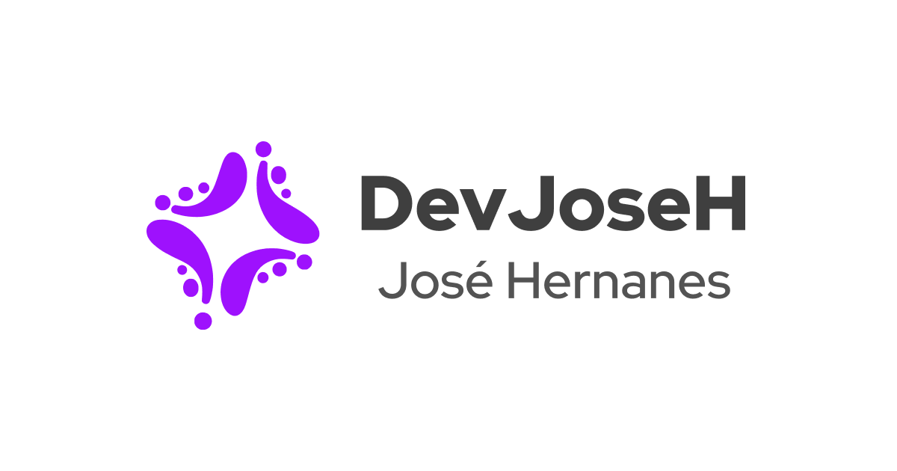
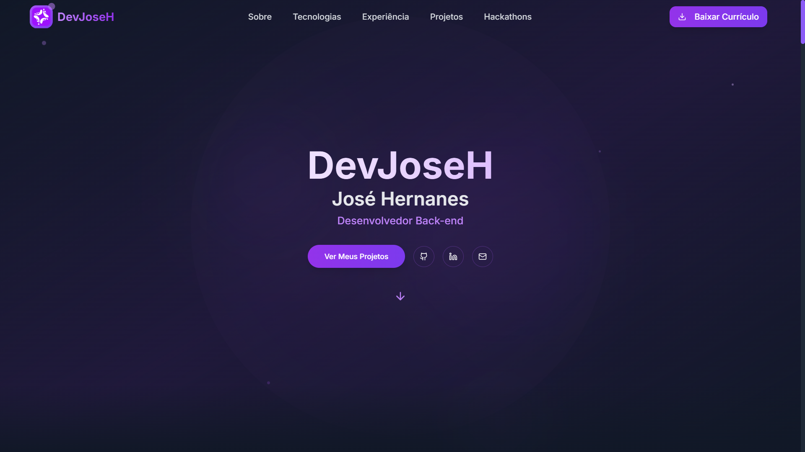
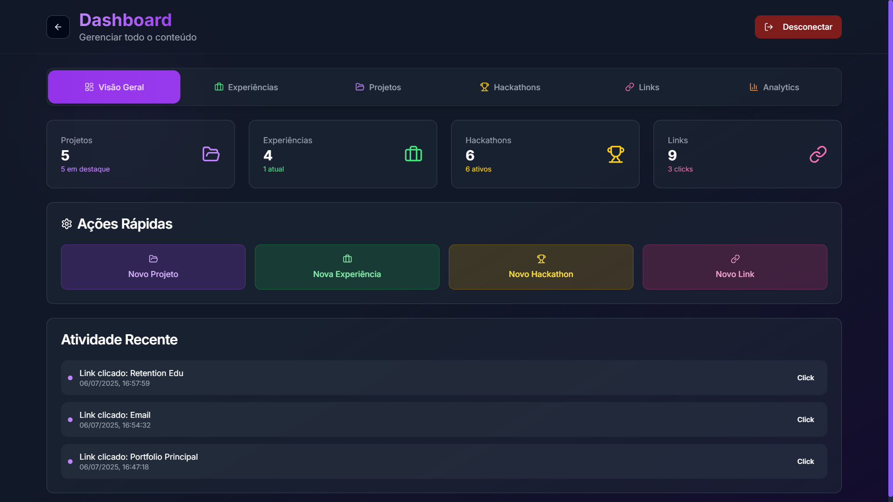

<p align="center">
  
  
  
  
   
</p>

<p align="center">
  <a href="https://devjoseh.com.br" target="_blank">
    
  </a>
</p>

Este é o repositório para a segunda versão do meu portfólio, desenvolvido para ser um hub central para minhas informações profissionais, projetos, e links relevantes. O projeto foi construído com Next.js e utiliza Supabase para gerenciamento de dados dinâmicos, como posts de blog, projetos, e informações de perfil.

## 📸 Screenshots

| Página Principal | Área Administrativa |
| :---: | :---: |
|  |  |

## 🚀 Começando

Para executar este projeto localmente, você precisará ter o [Node.js](https://nodejs.org/) (versão 20 ou superior) e o [npm](https://www.npmjs.com/) instalados em sua máquina.

1. **Clone o repositório:**
   ```bash
   git clone https://github.com/devjoseh/devjoseh-portfolio-v2.git
   cd devjoseh-portfolio-v2
   ```

2. **Instale as dependências:**
   ```bash
   npm install
   ```

3. **Configure o Supabase:**
   - Crie um novo projeto no [Supabase](https://supabase.com/).
   - Vá para o "SQL Editor" no painel do seu projeto Supabase.
   - Copie e cole o conteúdo dos arquivos localizados em `utils/supabase/schema/` na ordem correta para criar as tabelas, policies, funções, triggers e popular o banco com dados iniciais (seeders).

4. **Configure as variáveis de ambiente:**
   Renomeie o arquivo ``.env.example` para `.env.local` e adicione as seguintes variáveis de ambiente, substituindo os valores pelos da sua instância do Supabase e Turnstile da CloudFlare:
   ```env
   SUPABASE_URL=
   SUPABASE_ANON_KEY=
   SUPABASE_SERVICE_ROLE_KEY=

   NEXT_PUBLIC_SITE_KEY=
   TURNSTILE_SECRET_KEY=
   ```
   - Você pode encontrar as chaves do supabase em "Project Settings" > "API" no seu painel do Supabase.
   - Para obter a chave pública do Turnstile, acesse o site do [Turnstile](https://www.cloudflare.com/pt-br/application-services/products/turnstile/) e siga as instruções para obter a chave pública.

5. **Execute o projeto:**
   ```bash
   npm run dev
   ```
   Isso iniciará o servidor de desenvolvimento em `http://localhost:3000`.

### Outros Comandos

- **Build para produção:** `npm run build`
- **Iniciar o servidor de produção:** `npm run start`
- **Executar o linter:** `npm run lint`

## 🛠️ Ferramentas Recomendadas

Para otimizar e gerenciar os recursos visuais deste projeto, recomendo as seguintes ferramentas:

- **[Squoosh.app](https://squoosh.app/):** Uma ferramenta online e de código aberto do Google para compressão de imagens. Essencial para reduzir o tamanho dos arquivos de imagem sem perder qualidade, melhorando o tempo de carregamento do site.
- **[imgbb.com](https://imgbb.com/):** Um serviço de hospedagem de imagens gratuito e fácil de usar. Ideal para hospedar as imagens do seu portfólio e garantir que elas sejam carregadas rapidamente.

## ✨ Funcionalidades

O portfólio é dividido em duas áreas principais: a página pública e a área administrativa.

### Página Pública

- **Home:** Uma visão geral sobre mim, minhas habilidades e uma citação que me inspira.
- **Sobre:** Uma seção mais detalhada sobre minha jornada, minhas paixões e meus hobbies.
- **Experiência:** Uma linha do tempo com minhas experiências profissionais e acadêmicas.
- **Projetos:** Uma galeria com os projetos que desenvolvi, com links para o código-fonte e para a aplicação em produção.
- **Hackathons:** Uma seção dedicada aos hackathons que participei.
- **Links:** Uma lista de links úteis, como meu GitHub, LinkedIn, e outros perfis relevantes.

### Área Administrativa

A área administrativa é protegida por senha e permite o gerenciamento do conteúdo dinâmico do site.

- **Dashboard:** Uma visão geral das informações cadastradas.
- **Gerenciamento de Conteúdo:** CRUD (Criar, Ler, Atualizar, Deletar) para experiências, projetos, hackathons e links.

## 🛠️ Tecnologias Utilizadas

- **Framework:** [Next.js](https://nextjs.org/) (com App Router)
- **Linguagem:** [TypeScript](https://www.typescriptlang.org/)
- **Estilização:** [Tailwind CSS](https://tailwindcss.com/)
- **Componentes UI:** [shadcn/ui](https://ui.shadcn.com/)
- **Backend como Serviço (BaaS):** [Supabase](https://supabase.io/)
- **Segurança:** [Cloudflare Turnstile](https://www.cloudflare.com/products/turnstile/)
- **Linting:** [ESLint](https://eslint.org/)
- **Package Manager:** [npm](https://www.npmjs.com/)

## 📂 Estrutura do Projeto

A estrutura de pastas do projeto segue as convenções do Next.js App Router:

```
/
├── app/                # Contém todas as rotas, layouts e páginas
│   ├── admin/          # Páginas da área administrativa
│   ├── links/          # Página de links
│   └── ...
├── components/         # Componentes React reutilizáveis
│   ├── sections/       # Componentes de seções maiores (landing e admin)
│   └── ui/             # Componentes de UI genéricos (botões, cards, etc.)
├── lib/                # Funções utilitárias
├── public/             # Arquivos estáticos (imagens, fontes, etc.)
└── utils/              # Lógica de backend, ações e configuração do Supabase
    ├── actions/        # Server Actions para interagir com o backend
    └── supabase/       # Clientes e configurações do Supabase
```

## 🚀 Deploy

O deploy deste projeto é feito automaticamente através da [Vercel](https://vercel.com/). Cada push para a branch `main` aciona uma nova build e o deploy para o ambiente de produção.

## 🤝 Contribuindo

Contribuições são bem-vindas! Se você tiver alguma ideia para melhorar o projeto, sinta-se à vontade para abrir uma issue ou enviar um pull request.

1. **Fork** o projeto
2. Crie sua **Feature Branch** (`git checkout -b feature/AmazingFeature`)
3. **Commit** suas mudanças (`git commit -m 'Add some AmazingFeature'`)
4. **Push** para a Branch (`git push origin feature/AmazingFeature`)
5. Abra um **Pull Request**

## 📄 Licença

Este projeto está sob a licença MIT. Veja o arquivo `LICENSE` para mais detalhes.
